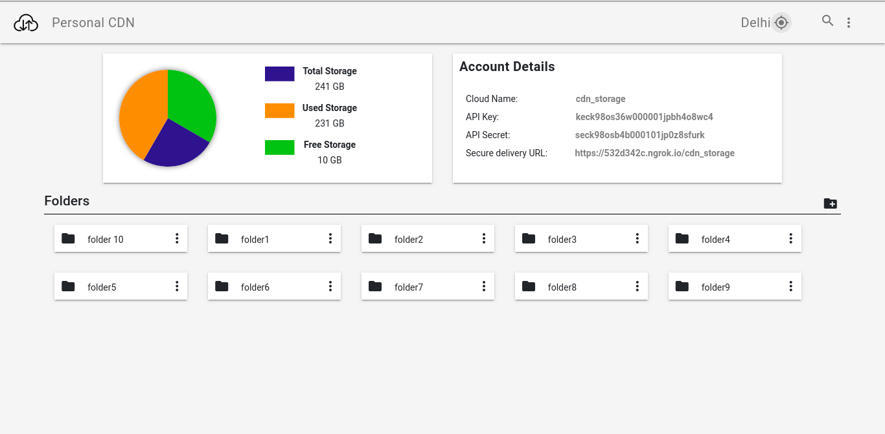

# Personal-Storage-System-PSS - Your secure personal storage system.

<b>PSS</b> is a simple and secure storage system and fully customizable as per one's need. Files can be stored in local storage as well as cloud storage such as Amazon, Google-cloud etc. Urls can be made fully secured by adding authorization to prevent unauthorized access of the files.

Images can be upload to the server using REST APIs as well as from the admin dashboard and the folders can be viewed with their respective files inside them.

  

<strong>Add authentication on URLs</strong> 

1. open - /etc/apache2/sites-available/Apache2Proxy.conf
2. Compare the below content with yours and add the missing lines into your file  
  -mainly <b>ProxyPass</b> and <b>ProxyPassReverse</b> is important
   
       <VirtualHost *:3000>
        ServerName localhost
        ServerAlias localhost
        ServerAdmin webmaster@example.com
        ErrorLog ${APACHE_LOG_DIR}/error.log
        CustomLog ${APACHE_LOG_DIR}/access.log combined
        
        ProxyRequests on
       
        <Proxy *>
          Order deny,allow
          Allow from all
        </Proxy>

        ProxyPass / http://127.0.0.1:<your_app_server_port>/auth_check/
        ProxyPassReverse / http://127.0.0.1:<your_app_server_port>/auth_check/

        <Location />
          Order allow,deny
          Allow from all
        </Location>
        </VirtualHost>
